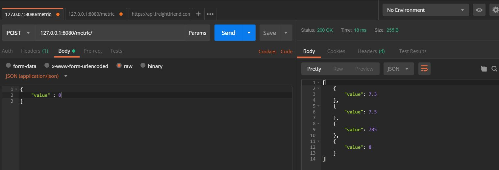
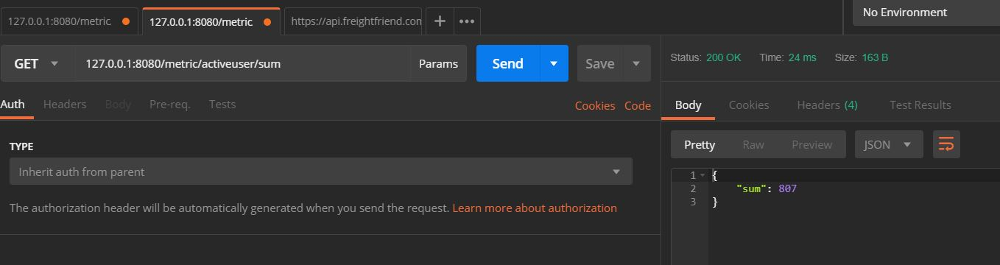

# metric-sum
## BSC

There are only 2 functions I have used which basically do all the functionality 

#### Funtion to store real time data with time stamps in dictionary
def timestamp_dict(data):
#### function to check latest 2 hours data
def sum_2hours()

Post request example

Get Request Example

Limitation:
1. It just support only one variable to store and show sum, but we can increase as per the usage

